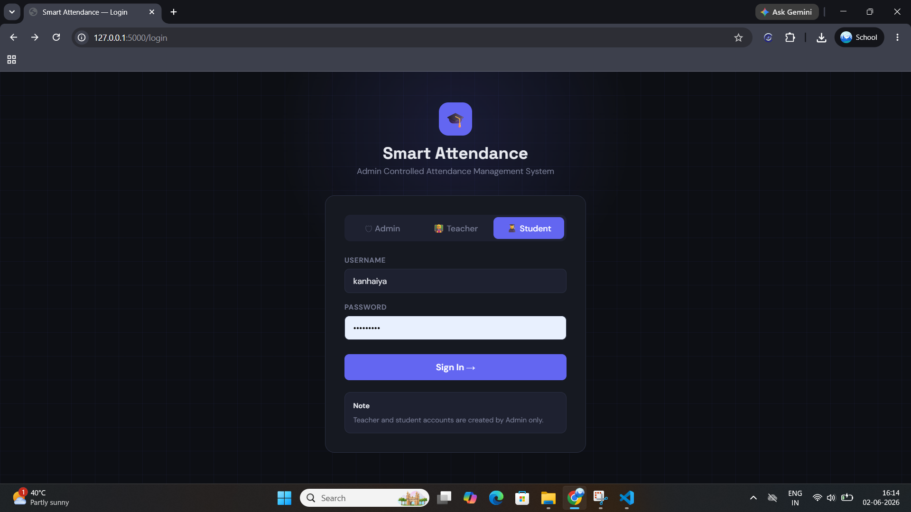
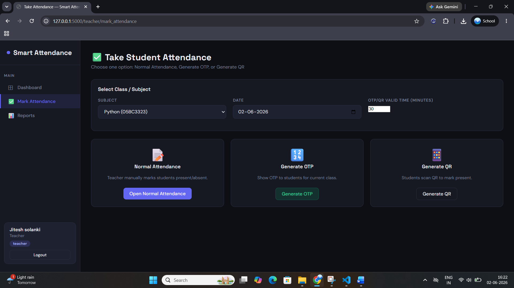
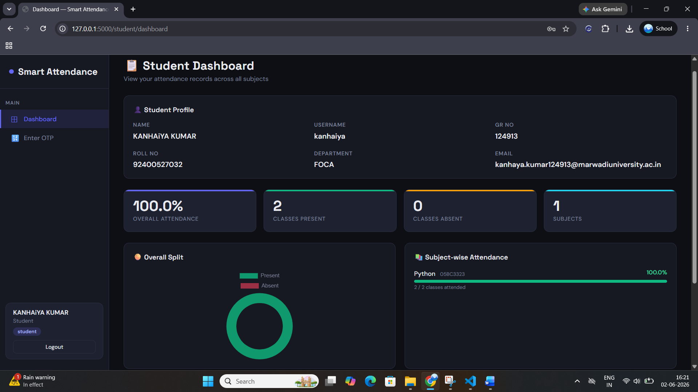

# Smart Attendance System

A simple and smart attendance management system developed using Python, Flask, SQLite, HTML, CSS, and JavaScript. This project helps teachers manage attendance records efficiently while allowing students to view their attendance details in a user-friendly dashboard.

## Project Overview

The Smart Attendance System was created to reduce the manual work involved in attendance management. The system provides separate panels for Admin, Teacher, and Student users. Teachers can manage attendance records, while students can track their attendance status and reports.

This project was developed as part of my learning journey in Web Development and Python programming.

## Features

## Admin Panel
- Admin Login
- Manage Teachers
- Manage Students
- View Attendance Records
- Dashboard Overview
- Search and Filter Data

### Teacher Panel
- Teacher Login
- Create Classes
- Add Students
- Mark Attendance
- View Attendance Reports
- Manage Student Records

## Student Panel
- Student Login
- View Attendance Percentage
- View Attendance History
- Personal Dashboard

## Additional Features
- QR Code Attendance Support
- OTP-Based Attendance Support
- Attendance Reports
- Responsive User Interface
- SQLite Database Integration
- Secure Login System

## Technologies Used

### Frontend
- HTML5
- CSS3
- JavaScript
- Bootstrap

### Backend
- Python
- Flask

### Database
- SQLite

### Other Libraries
- qrcode
- pandas
- openpyxl
- flask

## Project Structure

SmartAttendance/
│
├── app.py
├── attendance.db
├── requirements.txt
├── README.md
│
├── static/
│   ├── css/
│   ├── js/
│   ├── uploads/
│   └── qr/
│
├── templates/
│   ├── admin/
│   ├── teacher/
│   ├── student/
│   └── base.html
│
└── screenshots/

## Installation

### Step 1: Clone Repository

```bash
git clone https://github.com/your-username/smart-attendance-system.git
```

### Step 2: Open Project Folder

```bash
cd smart-attendance-system
```

### Step 3: Create Virtual Environment

```bash
python -m venv venv
```

### Step 4: Activate Virtual Environment

Windows:

```bash
venv\Scripts\activate
```

Linux/Mac:

```bash
source venv/bin/activate
```

### Step 5: Install Dependencies

```bash
pip install -r requirements.txt
```

### Step 6: Run Project

```bash
python app.py
```

### Step 7: Open Browser

http://127.0.0.1:5000


## Learning Outcomes

Through this project, I learned:

- Flask Web Development
- Database Integration using SQLite
- User Authentication
- Attendance Management Logic
- QR Code Generation
- Frontend and Backend Integration
- CRUD Operations
- Project Structure Organization

## Future Improvements

- Face Recognition Attendance
- GPS-Based Attendance Verification
- Email Notifications
- Mobile Application Version
- Advanced Analytics Dashboard
- Cloud Database Integration

## Screenshots

### Dashboard


### Attendance Page


### Student Panel


## Author

**Kanhaiya Kumar**

BCA Student  
Marwadi University

### Skills

- HTML
- CSS
- JavaScript
- Bootstrap
- Tailwind CSS
- Python
- Java
- MySQL
- Flask
- Git & Github
- C
- C#
- Data Structure using C

## Disclaimer

This project was developed for educational and learning purposes. It can be further enhanced and customized based on institutional requirements.

---

⭐ If you like this project, feel free to give it a star on GitHub.